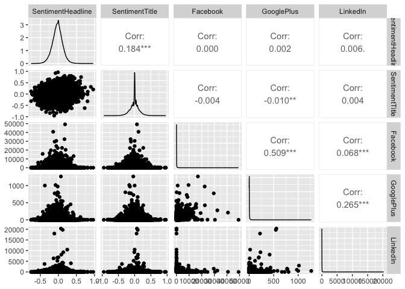

Linear Regression Mini-competition
================
Tanishq Daniel

``` r
library(tidyverse)
```

    ## ── Attaching core tidyverse packages ──────────────────────── tidyverse 2.0.0 ──
    ## ✔ dplyr     1.1.4     ✔ readr     2.1.4
    ## ✔ forcats   1.0.0     ✔ stringr   1.5.1
    ## ✔ ggplot2   3.4.4     ✔ tibble    3.2.1
    ## ✔ lubridate 1.9.3     ✔ tidyr     1.3.0
    ## ✔ purrr     1.0.2     
    ## ── Conflicts ────────────────────────────────────────── tidyverse_conflicts() ──
    ## ✖ dplyr::filter() masks stats::filter()
    ## ✖ dplyr::lag()    masks stats::lag()
    ## ℹ Use the conflicted package (<http://conflicted.r-lib.org/>) to force all conflicts to become errors

``` r
library(tidymodels)
```

    ## ── Attaching packages ────────────────────────────────────── tidymodels 1.1.1 ──
    ## ✔ broom        1.0.5     ✔ rsample      1.2.0
    ## ✔ dials        1.2.0     ✔ tune         1.1.2
    ## ✔ infer        1.0.5     ✔ workflows    1.1.3
    ## ✔ modeldata    1.2.0     ✔ workflowsets 1.0.1
    ## ✔ parsnip      1.1.1     ✔ yardstick    1.2.0
    ## ✔ recipes      1.0.8     
    ## ── Conflicts ───────────────────────────────────────── tidymodels_conflicts() ──
    ## ✖ scales::discard() masks purrr::discard()
    ## ✖ dplyr::filter()   masks stats::filter()
    ## ✖ recipes::fixed()  masks stringr::fixed()
    ## ✖ dplyr::lag()      masks stats::lag()
    ## ✖ yardstick::spec() masks readr::spec()
    ## ✖ recipes::step()   masks stats::step()
    ## • Dig deeper into tidy modeling with R at https://www.tmwr.org

``` r
library(skimr)
library(GGally)
```

    ## Registered S3 method overwritten by 'GGally':
    ##   method from   
    ##   +.gg   ggplot2

``` r
news <- read_csv("data/news.csv")
```

    ## Rows: 92431 Columns: 11
    ## ── Column specification ────────────────────────────────────────────────────────
    ## Delimiter: ","
    ## chr (5): Title, Headline, Source, Topic, PublishDate
    ## dbl (6): IDLink, SentimentTitle, SentimentHeadline, Facebook, GooglePlus, Li...
    ## 
    ## ℹ Use `spec()` to retrieve the full column specification for this data.
    ## ℹ Specify the column types or set `show_col_types = FALSE` to quiet this message.

``` r
skim(news)
```

|                                                  |       |
|:-------------------------------------------------|:------|
| Name                                             | news  |
| Number of rows                                   | 92431 |
| Number of columns                                | 11    |
| \_\_\_\_\_\_\_\_\_\_\_\_\_\_\_\_\_\_\_\_\_\_\_   |       |
| Column type frequency:                           |       |
| character                                        | 5     |
| numeric                                          | 6     |
| \_\_\_\_\_\_\_\_\_\_\_\_\_\_\_\_\_\_\_\_\_\_\_\_ |       |
| Group variables                                  | None  |

Data summary

**Variable type: character**

| skim_variable | n_missing | complete_rate | min | max | empty | n_unique | whitespace |
|:--------------|----------:|--------------:|----:|----:|------:|---------:|-----------:|
| Title         |         0 |             1 |   4 | 170 |     0 |    80572 |          0 |
| Headline      |        16 |             1 |   6 | 445 |     0 |    85889 |          0 |
| Source        |       342 |             1 |   2 |  72 |     0 |     5735 |          0 |
| Topic         |         0 |             1 |   5 |   9 |     0 |        4 |          0 |
| PublishDate   |         0 |             1 |  13 |  16 |     0 |    64291 |          0 |

**Variable type: numeric**

| skim_variable     | n_missing | complete_rate |     mean |       sd |    p0 |      p25 |      p50 |      p75 |      p100 | hist  |
|:------------------|----------:|--------------:|---------:|---------:|------:|---------:|---------:|---------:|----------:|:------|
| IDLink            |         0 |             1 | 51807.42 | 30297.05 |  1.00 | 24550.50 | 52449.00 | 76783.50 | 104802.00 | ▇▇▇▇▇ |
| SentimentTitle    |         0 |             1 |    -0.01 |     0.14 | -0.95 |    -0.08 |     0.00 |     0.06 |      0.96 | ▁▁▇▁▁ |
| SentimentHeadline |         0 |             1 |    -0.03 |     0.14 | -0.76 |    -0.11 |    -0.03 |     0.06 |      0.96 | ▁▅▇▁▁ |
| Facebook          |         0 |             1 |   114.11 |   622.77 | -1.00 |     0.00 |     5.00 |    34.00 |  49211.00 | ▇▁▁▁▁ |
| GooglePlus        |         0 |             1 |     3.93 |    18.57 | -1.00 |     0.00 |     0.00 |     2.00 |   1267.00 | ▇▁▁▁▁ |
| LinkedIn          |         0 |             1 |    16.69 |   155.12 | -1.00 |     0.00 |     0.00 |     4.00 |  20341.00 | ▇▁▁▁▁ |

``` r
summary(news)
```

    ##      IDLink          Title             Headline            Source         
    ##  Min.   :     1   Length:92431       Length:92431       Length:92431      
    ##  1st Qu.: 24550   Class :character   Class :character   Class :character  
    ##  Median : 52449   Mode  :character   Mode  :character   Mode  :character  
    ##  Mean   : 51807                                                           
    ##  3rd Qu.: 76784                                                           
    ##  Max.   :104802                                                           
    ##     Topic           PublishDate        SentimentTitle      SentimentHeadline 
    ##  Length:92431       Length:92431       Min.   :-0.950694   Min.   :-0.75543  
    ##  Class :character   Class :character   1st Qu.:-0.079025   1st Qu.:-0.11457  
    ##  Mode  :character   Mode  :character   Median : 0.000000   Median :-0.02606  
    ##                                        Mean   :-0.005415   Mean   :-0.02750  
    ##                                        3rd Qu.: 0.064385   3rd Qu.: 0.05965  
    ##                                        Max.   : 0.962354   Max.   : 0.96465  
    ##     Facebook         GooglePlus          LinkedIn       
    ##  Min.   :   -1.0   Min.   :  -1.000   Min.   :   -1.00  
    ##  1st Qu.:    0.0   1st Qu.:   0.000   1st Qu.:    0.00  
    ##  Median :    5.0   Median :   0.000   Median :    0.00  
    ##  Mean   :  114.1   Mean   :   3.928   Mean   :   16.69  
    ##  3rd Qu.:   34.0   3rd Qu.:   2.000   3rd Qu.:    4.00  
    ##  Max.   :49211.0   Max.   :1267.000   Max.   :20341.00

``` r
news %>% 
  select(SentimentHeadline,SentimentTitle,Facebook,GooglePlus,LinkedIn) %>% 
  ggpairs()
```

<!-- -->
